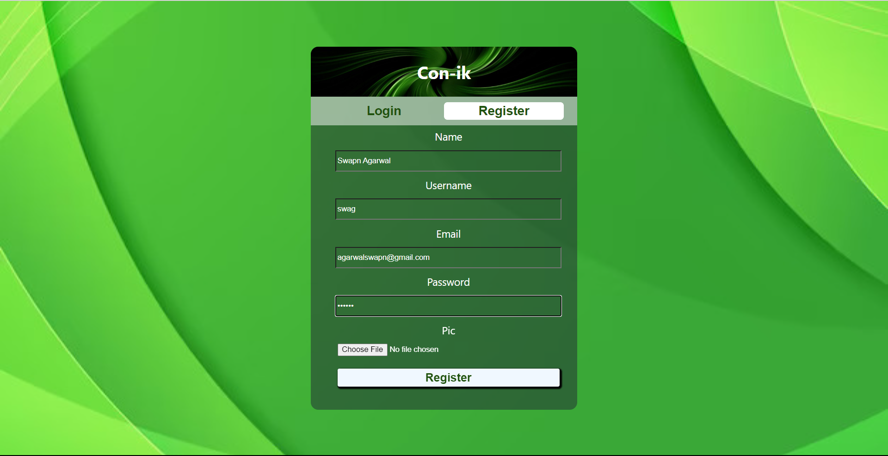
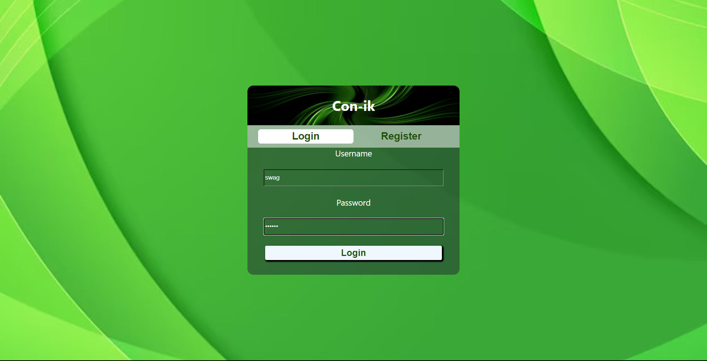
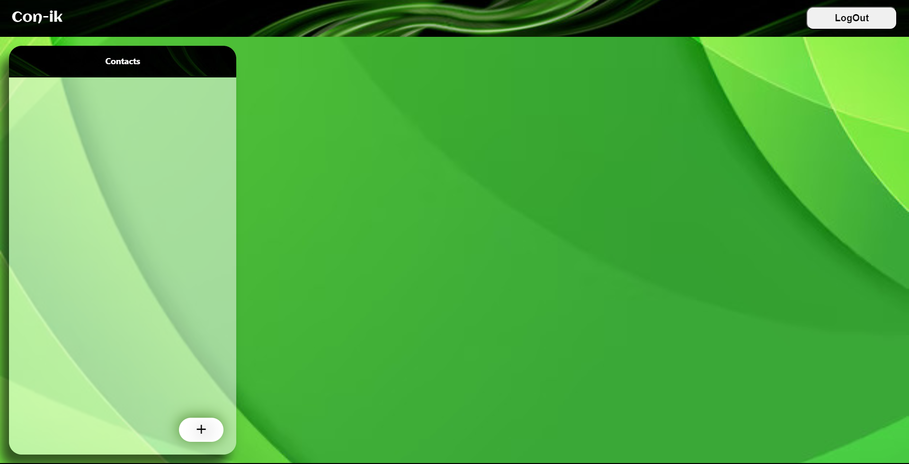
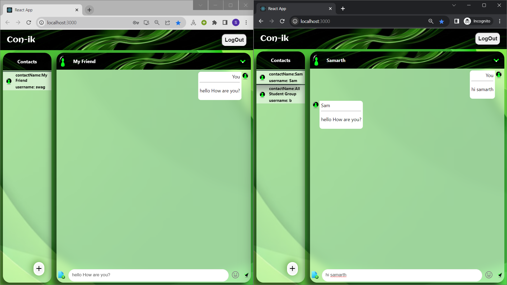
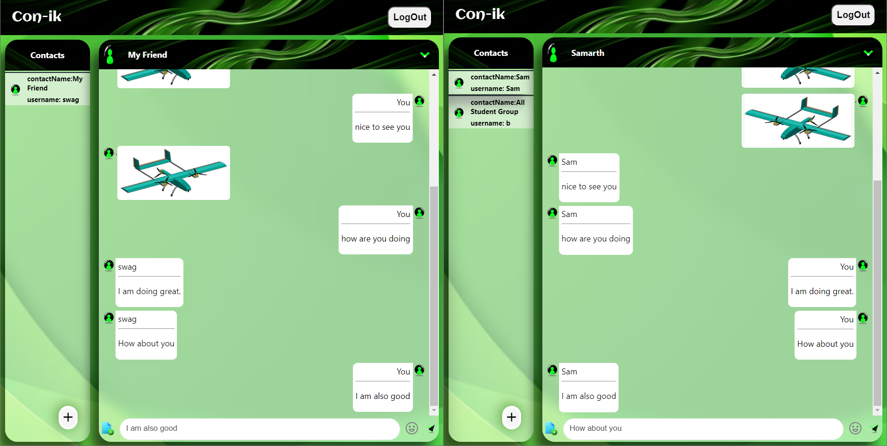
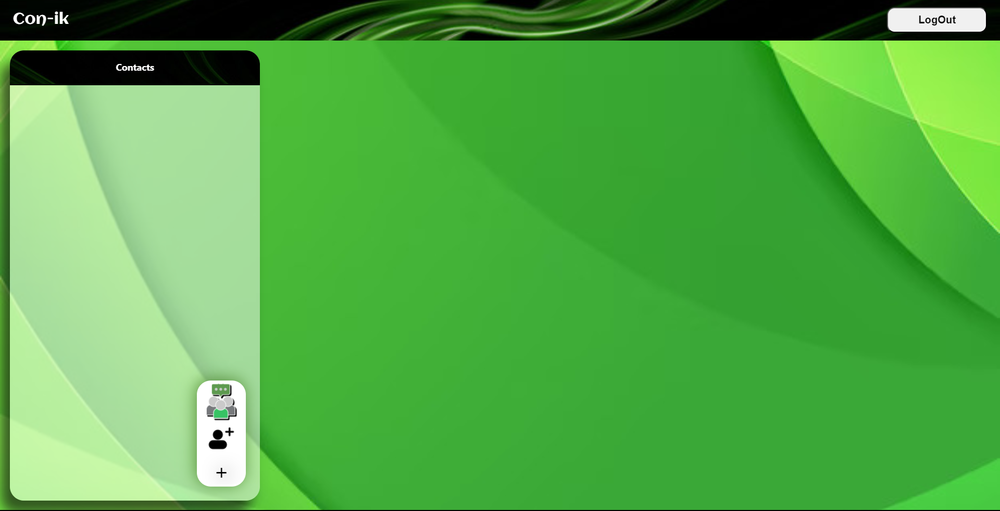
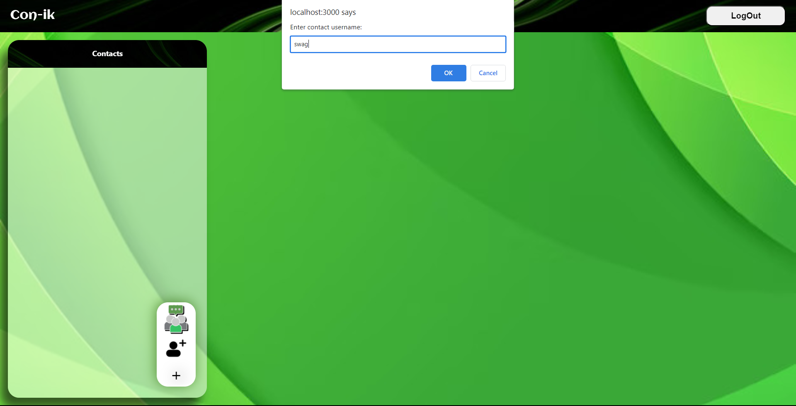

# **Con-ik: Connect and Link** 
##  -- Real Time Chatting & more -- 


Con-ik is a real-time chatting website that allows users to connect and link with their contacts and groups. Built using the MERN stack (MongoDB, Express.js, React.js, Node.js) and Socket.IO, Con-ik offers a seamless chatting experience with emoji support, and image sharing features.

## How to use?
 - Go to https://real-time-chating.netlify.app or http://localhost:3000 (if running locally).
 - Create your own new account by Registering.
 - After that Login to enter the application. 

## Technologies Used:

-	MERN Stack:
    - MongoDB Atlas: A NoSQL database used for storing user information, contacts, groups, and messages.
    -	Express.js: A web application framework for handling HTTP requests and routing.
    -	React.js: A JavaScript library for building user interfaces.
    -	Node.js: A JavaScript runtime environment used for server-side development.
-	Socket.IO: A library enabling real-time, bidirectional communication between web clients and servers.
-	Bcrypt: A password-hashing function used to securely store user passwords.
-	Cloudinary: An image and video hosting service for storing and managing images.
-	HTML, CSS, and JavaScript: Used for frontend development and styling.

## Features:

-	User Registration:
    -	Users can create an account by providing their email, a unique username and password.
    -	Passwords are securely encrypted using bcrypt before storage.
    -	Validation ensures the email and username is unique and adheres to the required format.
-	User Login:
    -	Registered users can log in using their username and password.
    -	Bcrypt is used to securely compare and authenticate user passwords.
-	Contact Management:
    -	Users can add contacts by the names they wish(need not be unique) and contact id as usernames.
    -	Validation of username ensures the contact exists and is not already added.
    -	Contacts are saved in the database for future reference.
-	Group Creation:
    -	Users can create groups by providing a name and selecting one group member initially and later adding other members.
    -	The creator of the group is automatically added as a member.
    -	Group details are stored in the database.
    -	Group is saved in contact list of all the group members
-	Member Addition to Groups:
    -	Group members can add members to their created groups.
    -	Group membership details are updated in the database.
-	Real-Time Messaging:
    -	Users can have real-time conversations with their contacts or group members.
    -	Messages are instantly delivered and displayed to all participants.
    -	Socket.IO facilitates real-time communication between the server and clients.
-	Emoji Support and Image Sharing:
    -	Users can express emotions by sending emojis during conversations.
    -	The website enables image sharing, allowing users to upload and share pictures in chats.
    -	Images are stored securely using Cloudinary and MongoDB Atlas.

## Run Locally

Clone the project

```bash
  https://github.com/Manish1660/Real-Time-Chat.git
```

Go to the project directory

```bash
  cd Real-Time-Chat
```

Install dependencies

```bash
 
  cd frontend/
  npm install
```
```bash 
  cd..
  cd backend/
  npm install
```
Configure the MongoDB connection:
-	Create a MongoDB database and obtain the connection URI.
-	Replace the placeholder MongoDB URI in the server configuration file (backend/config/db.js) with your actual URI.


Start the server

```bash
  node index.js
```
Start the Client

```bash
  //open new terminal
  cd frontend
  npm run start
```
To Run on browser
-	Access the Con-ik website in your browser at http://localhost:3000.


## Web Application Snippets


1. Registration



2. Login



3. Real Time Chat with Emoji 




4. Image share



5. Adding Contacts, Groups and Group Members




